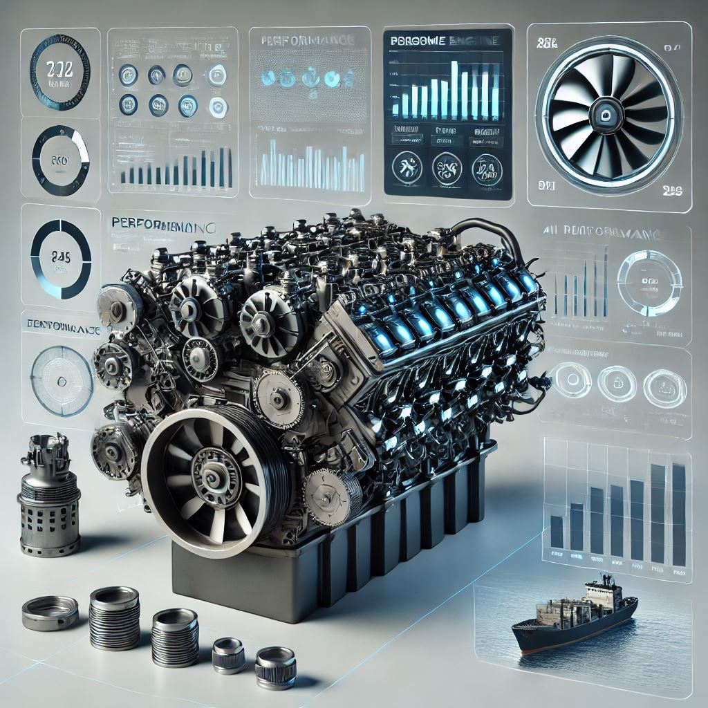

<h2 style="margin-top: 0;"><strong>Smart Engine AI: Artificial Intelligence for Monitoring and Predictive Maintenance of Industrial Engines</strong></h2>

    

    <h2><strong>Introduction</strong></h2> 
        

            The shipping industry and modern factories face significant challenges in the maintenance and reliability of their equipment – ​​whether marine engines or industrial machines – which are essential for safe and efficient operations. Unexpected failures can cause operational delays, increased repair costs, environmental risks and direct threats to the safety of operators and crew, as shown by recent studies (Marques & Brito, 2019).

            

            In a vulnerable environment, extreme conditions and the complexity of systems increase component wear, increasing the likelihood of failures if not identified in time (Macnica DHW, 2023). At the same time, in industrial facilities, machines operate under intense conditions – with load variations, expose aggressive environments and high temperatures – which also accelerates the wear of components and compromises the continuity of production.

            

           To mitigate these impacts in both sectors, failure prediction and the implementation of predictive maintenance become essential. This approach allows for scheduled interventions that reduce downtime, optimize operational costs and extend the useful life of equipment (Filtrovali, 2019).

            

            Furthermore, the use of advanced technologies – such as IoT sensors, vibration analysis, thermography and artificial intelligence algorithms – has revolutionized the way data is collected and analyzed. These systems enable continuous monitoring of critical operational parameters, allowing anomalies to be detected at an early stage in both the naval and industrial industries. Thus, it is possible to act before catastrophic failures occur, ensuring safer operation, increasing asset reliability and promoting a significant cost reduction with corrective maintenance.

            

            With the digitalization of the naval industry and the advancement of the Internet of Things (IoT), embedded sensors are widely used to monitor critical operational variables, such as:

            <ul>
            <li><strong>Engine temperature</strong></li>
            <li><strong>Vibration levels</strong></li>
            <li><strong>Lube oil pressure</strong></li>
            <li><strong>Fuel consumption</strong></li>
            <li><strong>Level of mechanical wear</strong></li>
            <li><strong>Occurrence of leaks</li></strong>
            </ul>
         

            Analyzing this data allows you to predict failures before they occur, reducing downtime and optimizing maintenance planning.
         

          <h2><strong> Project Summary</strong>
</h2>
         <strong>Smart Engine AI</strong> is an artificial intelligence system that combines <strong>autonomous agents</strong>, <strong>machine learning</strong> and physical modeling to transform the monitoring and maintenance of industrial and marine engines. It uses a multi-agent approach to analyze sensor data in real time, predict failures and automate decisions, reducing operational costs and optimizing equipment reliability.
         

         

    

    

        
    

        <h3><strong>Autonomous Agents:</strong>
</h3>
        The solution employs a multi-agent architecture, with agents specialized in different tasks:

        

        <ul>
        <li><strong>Real-Time Engine Data Monitor:</strong> Continuously collects, processes, and visualizes engine sensor data, providing real-time insights into engine health and performance.</li>  
        <li><strong>Engine Failure Prediction Expert:</strong> Utilizes advanced machine learning models to analyze sensor data, detecting patterns that indicate potential failures before they occur.</li>  
        <li><strong>Engine Performance Reporting Analyst:</strong> Transforms raw engine data into comprehensive reports, highlighting key performance metrics and actionable insights for optimization.</li>  
        <li><strong>Engine Maintenance Advisor:</strong> Leverages Retrieval-Augmented Generation (<strong>RAG</strong>) techniques to access and analyze technical manuals, providing highly accurate maintenance recommendations based on real-time diagnostics and historical data.</li>
         

         </ul>
        These agents communicate and coordinate with each other, allowing dynamic adjustments to engine operation and anticipating problems before they become critical.
         

    <h3><strong> Technologies Used</strong>
</h3>
    <ul>
    <li><strong>LLMs (Large Language Models):</strong> Assist in analyzing and interpreting data to recognize patterns and provide maintenance recommendations.</li>
    <li><strong>Machine Learning Pipeline:</strong> Uses trained models to classify the state of motors and predict failures.</li>
    <li><strong>Advanced Sensor Simulation:</strong> As this is a theoretical study, we use mathematical functions to simulate combustion engine sensor parameters, ensuring the minimum representation of real operating conditions.</li>
    <li><strong>Report Automation:</strong> Agents generate statistical and visual reports on engine operation to support decision making.

    </ul>
    <h3><strong>Solution Structure</strong>
</h3>
    <ol type="I">
    <strong><li>Data Collection and Processing:</strong> Sensors capture variables such as temperature, vibration, pressure, fuel consumption, wear and leaks, feeding the machine learning model.</li>
    <li><strong>Fault Prediction and Intelligent Analysis:</strong> Agents use machine learning model predictions about possible engine failures, detect anomalies and suggest corrective actions during operation aiming at performance and safe operation of the equipment.</li>
    <li><strong>Visualization and Decision Making:</strong> At the end of the operation, an automated report is generated that presents statistics and trend graphs on the conditions of the engines during the period of operation.</li>
    </ol type="I">
<h3><strong>Expected Results</strong>
</h3>
<ul>
    <li><strong>Cost Reduction:</strong> Minimizes emergency maintenance and unexpected failures.</li>
    <li><strong>Greater Reliability and Security:</strong> Anticipating problems reduces risks and increases operational security.</li>
    <li><strong>Operational Efficiency:</strong> Improves engine performance and fuel consumption.</li>
    <li><strong>Data-Based Strategic Decisions:</strong> Facilitates planning and allocation of maintenance resources.</li>
</ul>

