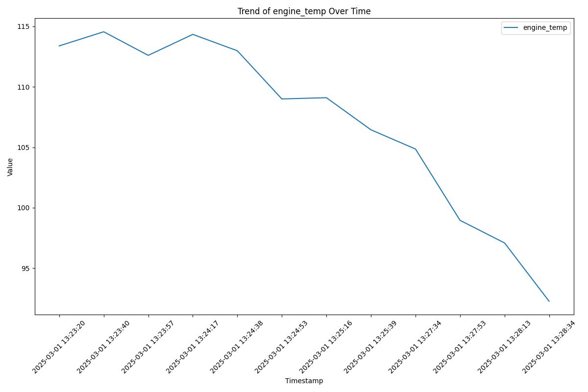
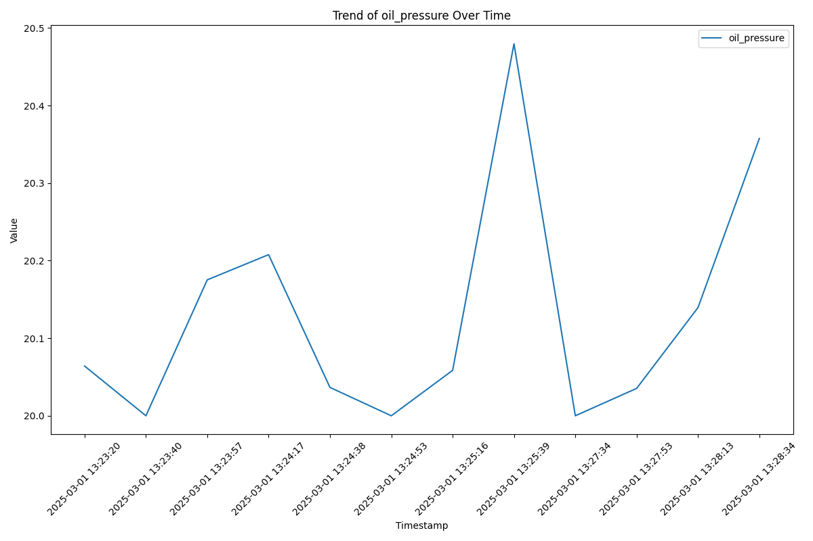
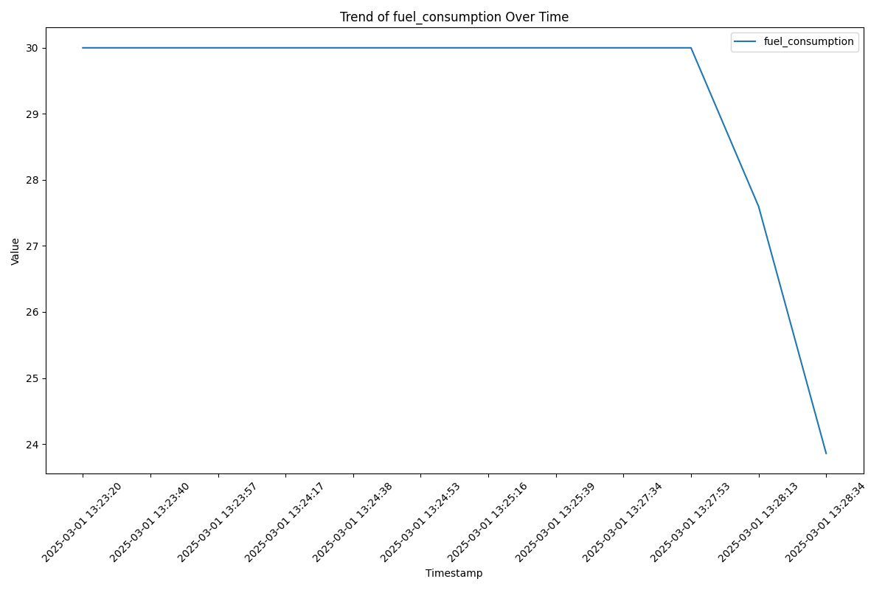
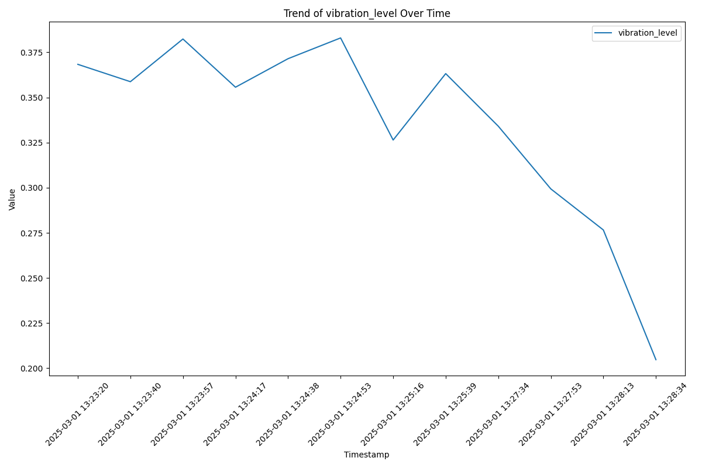
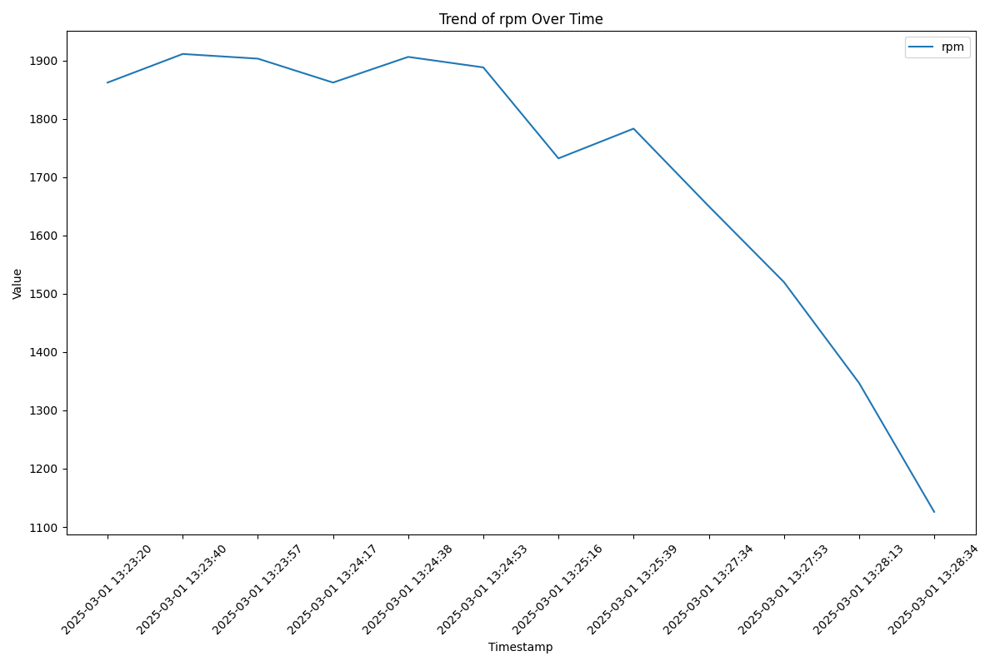
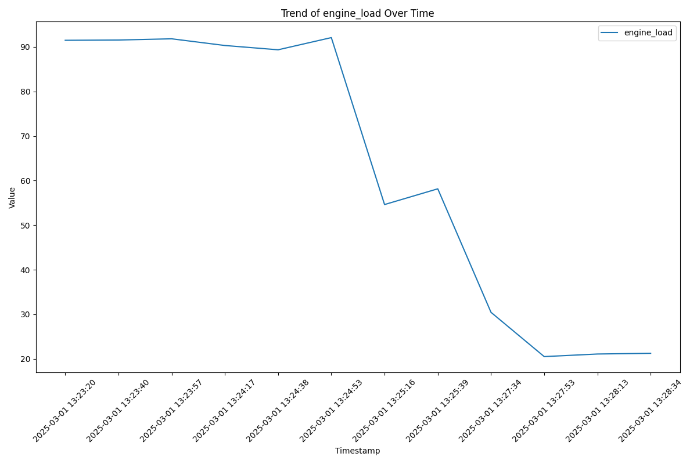

# Engine Performance Report

## Trend Analysis
- Maximum Temperature: 114.56°C
- Average Temperature: 107.13°C
- Minimum Temperature: 92.26°C
- Maximum Oil Pressure: 20.48 psi
- Average Oil Pressure: 20.13 psi
- Minimum pressure: 20.00 psi
- Fuel Consumption Trend: -0.31
- Vibration Anomalies: 9

## Component Health
- Cooling Efficiency: 79.6%
- Oil Viscosity: 0.84
- Injector Health: 73.2%

## Chronology of Events
### 2025-03-01 13:23:20 - Failure Prediction
- **Expected Class:** Overheating
- **Probabilities per Failure Module:**

|Failure Class         | Probability |
|----------------------|---------------|
| Fuel Issues          |          0.01 |
| Mechanical Wear      |          0.07 |
| No Failure           |          0.01 |
| Oil Leakage          |          0.00 |
| Overheating          |          0.91 |

- **Sensor Data:** {
  "engine_temp": 113.38694744164144,
  "running_period": 101,
  "oil_pressure": 20.06413256046115,
  "fuel_consumption": 30.0,
  "vibration_level": 0.3683527028091378,
  "rpm": 1862,
  "engine_load": 91.49517037717388,
  "timestamp": "2025-03-01 13:23:20"
}

### 2025-03-01 13:23:38 - Corrective Action
- **Action:** `"reduce_load"`
- **Reason:** "The engine load is currently at 91%, which is above the recommended maximum of 80%. Reducing the load can help lower the engine temperature and prevent overheating."

### 2025-03-01 13:23:40 - Failure Prediction
- **Expected Class:** Overheating
- **Probabilities per Failure Module:**

|Failure Class         | Probability |
|----------------------|---------------|
| Fuel Issues          |          0.01 |
| Mechanical Wear      |          0.06 |
| No Failure           |          0.01 |
| Oil Leakage          |          0.00 |
| Overheating          |          0.91 |

- **Sensor Data:** {
  "engine_temp": 114.55571205159083,
  "running_period": 104,
  "oil_pressure": 20.0,
  "fuel_consumption": 30.0,
  "vibration_level": 0.35874010162076597,
  "rpm": 1911,
  "engine_load": 91.55547246247006,
  "timestamp": "2025-03-01 13:23:40"
}

### 2025-03-01 13:23:40 - Corrective Action
- **Action:** `Action: "reduce_load"`
- **Reason:** Reason: "The engine load is currently at 91%, which is above the recommended maximum of 80%. Reducing the load can help lower the engine temperature and prevent overheating."

### 2025-03-01 13:23:55 - Corrective Action
- **Action:** `"reduce_load"`
- **Reason:** "The engine load is currently at 91%, which is above the maximum limit of 80%. Reducing the load will help to decrease the engine temperature and prevent overheating."

### 2025-03-01 13:23:57 - Failure Prediction
- **Expected Class:** Overheating
- **Probabilities per Failure Module:**

|Failure Class         | Probability |
|----------------------|---------------|
| Fuel Issues          |          0.01 |
| Mechanical Wear      |          0.06 |
| No Failure           |          0.01 |
| Oil Leakage          |          0.00 |
| Overheating          |          0.91 |

- **Sensor Data:** {
  "engine_temp": 112.60357306130979,
  "running_period": 107,
  "oil_pressure": 20.175260874978417,
  "fuel_consumption": 30.0,
  "vibration_level": 0.38238717478267026,
  "rpm": 1903,
  "engine_load": 91.82866223207957,
  "timestamp": "2025-03-01 13:23:57"
}

### 2025-03-01 13:23:57 - Corrective Action
- **Action:** `Action: "reduce_load"`
- **Reason:** Reason: "The engine load is currently at 91%, which is above the maximum limit of 80%. Reducing the load will help to decrease the engine temperature and prevent overheating."

### 2025-03-01 13:24:15 - Corrective Action
- **Action:** `"reduce_load"`
- **Reason:** "The engine load is currently at 91%, which is above the recommended maximum of 80%. Reducing the load will help to lower the engine temperature and prevent overheating."

### 2025-03-01 13:24:17 - Failure Prediction
- **Expected Class:** Overheating
- **Probabilities per Failure Module:**

|Failure Class         | Probability |
|----------------------|---------------|
| Fuel Issues          |          0.01 |
| Mechanical Wear      |          0.07 |
| No Failure           |          0.01 |
| Oil Leakage          |          0.00 |
| Overheating          |          0.91 |

- **Sensor Data:** {
  "engine_temp": 114.34105212209747,
  "running_period": 110,
  "oil_pressure": 20.207765777439572,
  "fuel_consumption": 30.0,
  "vibration_level": 0.355685374897222,
  "rpm": 1862,
  "engine_load": 90.32702811725389,
  "timestamp": "2025-03-01 13:24:17"
}

### 2025-03-01 13:24:17 - Corrective Action
- **Action:** `Action: "reduce_load"`
- **Reason:** Reason: "The engine load is currently at 91%, which is above the recommended maximum of 80%. Reducing the load will help to lower the engine temperature and prevent overheating."

### 2025-03-01 13:24:35 - Corrective Action
- **Action:** `"reduce_load"`
- **Reason:** "The engine load is currently at 91%, which is above the recommended maximum of 80%. Reducing the load can help to lower the engine temperature and prevent overheating. Additionally, a thorough inspection and maintenance of the cooling system is recommended to ensure its optimal performance."

### 2025-03-01 13:24:38 - Failure Prediction
- **Expected Class:** Overheating
- **Probabilities per Failure Module:**

|Failure Class         | Probability |
|----------------------|---------------|
| Fuel Issues          |          0.01 |
| Mechanical Wear      |          0.06 |
| No Failure           |          0.01 |
| Oil Leakage          |          0.00 |
| Overheating          |          0.91 |

- **Sensor Data:** {
  "engine_temp": 112.98397866472996,
  "running_period": 113,
  "oil_pressure": 20.036573357116403,
  "fuel_consumption": 30.0,
  "vibration_level": 0.37147967756136663,
  "rpm": 1906,
  "engine_load": 89.36434369878046,
  "timestamp": "2025-03-01 13:24:38"
}

### 2025-03-01 13:24:38 - Corrective Action
- **Action:** `Action: "reduce_load"`
- **Reason:** Reason: "The engine load is currently at 91%, which is above the recommended maximum of 80%. Reducing the load can help to lower the engine temperature and prevent overheating. Additionally, a thorough inspection and maintenance of the cooling system is recommended to ensure its optimal performance."

### 2025-03-01 13:24:51 - Corrective Action
- **Action:** `"cool_down"`
- **Reason:** "The engine is overheating due to exceeding the normal operating limits. The main factors include failures in the cooling system, inadequate circulation of lubricating oil, and abnormal combustion. To prevent further overheating, we need to ensure adequate airflow to engine components, implement redundant cooling systems, install sensors to monitor not only coolant temperature but also pressure, flow rate, and oil temperature, and establish a preventive maintenance program."

### 2025-03-01 13:24:53 - Failure Prediction
- **Expected Class:** Overheating
- **Probabilities per Failure Module:**

|Failure Class         | Probability |
|----------------------|---------------|
| Fuel Issues          |          0.01 |
| Mechanical Wear      |          0.06 |
| No Failure           |          0.01 |
| Oil Leakage          |          0.00 |
| Overheating          |          0.91 |

- **Sensor Data:** {
  "engine_temp": 108.99769918256604,
  "running_period": 116,
  "oil_pressure": 20.0,
  "fuel_consumption": 30.0,
  "vibration_level": 0.38298452027838403,
  "rpm": 1888,
  "engine_load": 92.09883344013255,
  "timestamp": "2025-03-01 13:24:53"
}

### 2025-03-01 13:24:53 - Corrective Action
- **Action:** `Action: "cool_down"`
- **Reason:** Reason: "The engine is overheating due to exceeding the normal operating limits. The main factors include failures in the cooling system, inadequate circulation of lubricating oil, and abnormal combustion. To prevent further overheating, we need to ensure adequate airflow to engine components, implement redundant cooling systems, install sensors to monitor not only coolant temperature but also pressure, flow rate, and oil temperature, and establish a preventive maintenance program."

### 2025-03-01 13:25:14 - Corrective Action
- **Action:** `reduce_load`
- **Reason:** The engine is currently overheating, with a high engine load and low oil pressure. Reducing the load could help alleviate the overheating issue by reducing the demand on the engine and potentially improving the circulation of lubricating oil.Reduced load to avoid overloading.

### 2025-03-01 13:25:16 - Failure Prediction
- **Expected Class:** Overheating
- **Probabilities per Failure Module:**

|Failure Class         | Probability |
|----------------------|---------------|
| Fuel Issues          |          0.00 |
| Mechanical Wear      |          0.00 |
| No Failure           |          0.03 |
| Oil Leakage          |          0.00 |
| Overheating          |          0.97 |

- **Sensor Data:** {
  "engine_temp": 109.101501530752,
  "running_period": 119,
  "oil_pressure": 20.058589060757836,
  "fuel_consumption": 30.0,
  "vibration_level": 0.3264263962610473,
  "rpm": 1732,
  "engine_load": 54.62597456607755,
  "timestamp": "2025-03-01 13:25:16"
}

### 2025-03-01 13:25:16 - Corrective Action
- **Action:** `Action: reduce_load`
- **Reason:** Reason: The engine is currently overheating, with a high engine load and low oil pressure. Reducing the load could help alleviate the overheating issue by reducing the demand on the engine and potentially improving the circulation of lubricating oil.

### 2025-03-01 13:25:37 - Corrective Action
- **Action:** `"cool_down"`
- **Reason:** "The engine is at risk of overheating. Cooling down the engine will help to bring the temperature back within the safe operating range. Additionally, the oil pressure is below the minimum limit. Checking the oil pressure and possibly changing the oil could help to resolve this issue."

### 2025-03-01 13:25:39 - Failure Prediction
- **Expected Class:** Overheating
- **Probabilities per Failure Module:**

|Failure Class         | Probability |
|----------------------|---------------|
| Fuel Issues          |          0.01 |
| Mechanical Wear      |          0.01 |
| No Failure           |          0.03 |
| Oil Leakage          |          0.00 |
| Overheating          |          0.95 |

- **Sensor Data:** {
  "engine_temp": 106.44627460386046,
  "running_period": 122,
  "oil_pressure": 20.47960050792794,
  "fuel_consumption": 30.0,
  "vibration_level": 0.36322196423186165,
  "rpm": 1783,
  "engine_load": 58.15780558729894,
  "timestamp": "2025-03-01 13:25:39"
}

### 2025-03-01 13:25:39 - Corrective Action
- **Action:** `Action: "cool_down"`
- **Reason:** Reason: "The engine is at risk of overheating. Cooling down the engine will help to bring the temperature back within the safe operating range. Additionally, the oil pressure is below the minimum limit. Checking the oil pressure and possibly changing the oil could help to resolve this issue."

### 2025-03-01 13:27:32 - Corrective Action
- **Action:** `reduce_load`
- **Reason:** The engine is currently at risk of overheating with a high probability of 95.33%. Reducing the load would decrease the engine's workload and potentially help to control the temperature. It's also important to continue monitoring the engine's status to detect any issues early and take appropriate actions.Reduced load to avoid overloading.

### 2025-03-01 13:27:34 - Failure Prediction
- **Expected Class:** Overheating
- **Probabilities per Failure Module:**

|Failure Class         | Probability |
|----------------------|---------------|
| Fuel Issues          |          0.01 |
| Mechanical Wear      |          0.00 |
| No Failure           |          0.08 |
| Oil Leakage          |          0.00 |
| Overheating          |          0.91 |

- **Sensor Data:** {
  "engine_temp": 104.85442587160556,
  "running_period": 125,
  "oil_pressure": 20.0,
  "fuel_consumption": 30.0,
  "vibration_level": 0.3341092298541822,
  "rpm": 1650,
  "engine_load": 30.43721623572943,
  "timestamp": "2025-03-01 13:27:34"
}

### 2025-03-01 13:27:34 - Corrective Action
- **Action:** `Action: reduce_load`
- **Reason:** Reason: The engine is currently at risk of overheating with a high probability of 95.33%. Reducing the load would decrease the engine's workload and potentially help to control the temperature. It's also important to continue monitoring the engine's status to detect any issues early and take appropriate actions.

### 2025-03-01 13:27:51 - Corrective Action
- **Action:** `reduce_load`
- **Reason:** The engine is currently at risk of overheating with a temperature of 104.0°C, which is close to the upper limit of 120°C. The oil pressure is also below the minimum safe limit of 25 psi. Reducing the load will help to bring down the temperature and prevent potential damage to the engine. This should be followed by a thorough inspection and maintenance of the cooling system as per the guidelines in the document.Reduced load to avoid overloading.

### 2025-03-01 13:27:53 - Failure Prediction
- **Expected Class:** Overheating
- **Probabilities per Failure Module:**

|Failure Class         | Probability |
|----------------------|---------------|
| Fuel Issues          |          0.01 |
| Mechanical Wear      |          0.01 |
| No Failure           |          0.13 |
| Oil Leakage          |          0.01 |
| Overheating          |          0.85 |

- **Sensor Data:** {
  "engine_temp": 98.95527667283166,
  "running_period": 128,
  "oil_pressure": 20.035330113321944,
  "fuel_consumption": 30.0,
  "vibration_level": 0.2993647883371605,
  "rpm": 1520,
  "engine_load": 20.49845431491701,
  "timestamp": "2025-03-01 13:27:53"
}

### 2025-03-01 13:27:53 - Corrective Action
- **Action:** `Action: reduce_load`
- **Reason:** Reason: The engine is currently at risk of overheating with a temperature of 104.0°C, which is close to the upper limit of 120°C. The oil pressure is also below the minimum safe limit of 25 psi. Reducing the load will help to bring down the temperature and prevent potential damage to the engine. This should be followed by a thorough inspection and maintenance of the cooling system as per the guidelines in the document.

### 2025-03-01 13:28:11 - Corrective Action
- **Action:** `reduce_load`
- **Reason:** The engine is currently at risk of overheating with a temperature of 99.9°C, which is close to the upper limit of 120°C. The oil pressure is also below the minimum safe limit of 25 psi. Reducing the load will help to lower the engine temperature and prevent overheating. In addition, maintenance should be scheduled to inspect and repair the cooling system and improve oil circulation, as suggested in the Engine_1.docx document.Reduced load to avoid overloading.

### 2025-03-01 13:28:13 - Failure Prediction
- **Expected Class:** Overheating
- **Probabilities per Failure Module:**

|Failure Class         | Probability |
|----------------------|---------------|
| Fuel Issues          |          0.01 |
| Mechanical Wear      |          0.01 |
| No Failure           |          0.13 |
| Oil Leakage          |          0.00 |
| Overheating          |          0.85 |

- **Sensor Data:** {
  "engine_temp": 97.08382201303989,
  "running_period": 131,
  "oil_pressure": 20.13954037074187,
  "fuel_consumption": 27.598320702022516,
  "vibration_level": 0.27660063957375186,
  "rpm": 1347,
  "engine_load": 21.07817560701344,
  "timestamp": "2025-03-01 13:28:13"
}

### 2025-03-01 13:28:13 - Corrective Action
- **Action:** `Action: reduce_load`
- **Reason:** Reason: The engine is currently at risk of overheating with a temperature of 99.9°C, which is close to the upper limit of 120°C. The oil pressure is also below the minimum safe limit of 25 psi. Reducing the load will help to lower the engine temperature and prevent overheating. In addition, maintenance should be scheduled to inspect and repair the cooling system and improve oil circulation, as suggested in the Engine_1.docx document.

### 2025-03-01 13:28:32 - Corrective Action
- **Action:** `cool_down`
- **Reason:** The engine is at risk of overheating and the cooling efficiency is not optimal. Cooling down the engine will help to reduce the temperature and prevent damage to internal components. Engine cooling, RPM reduced to 1100.1191485451004.

### 2025-03-01 13:28:34 - Failure Prediction
- **Expected Class:** Mechanical Wear
- **Probabilities per Failure Module:**

|Failure Class         | Probability |
|----------------------|---------------|
| Fuel Issues          |          0.01 |
| Mechanical Wear      |          0.68 |
| No Failure           |          0.07 |
| Oil Leakage          |          0.03 |
| Overheating          |          0.21 |

- **Sensor Data:** {
  "engine_temp": 92.25924586571307,
  "running_period": 134,
  "oil_pressure": 20.357552219354197,
  "fuel_consumption": 23.85724931855946,
  "vibration_level": 0.20474582025849614,
  "rpm": 1126,
  "engine_load": 21.237533284677937,
  "timestamp": "2025-03-01 13:28:34"
}

### 2025-03-01 13:28:34 - Corrective Action
- **Action:** `Action: cool_down`
- **Reason:** Reason: The engine is at risk of overheating and the cooling efficiency is not optimal. Cooling down the engine will help to reduce the temperature and prevent damage to internal components.

### 2025-03-01 13:29:16 - Corrective Action
- **Action:** `"maintain_boost"`
- **Reason:** "The engine is currently in a high demand mode with a target performance of 150%. The current RPM and load are within safe limits. However, the engine is at risk of overheating and the oil pressure is low. A preventive maintenance check is needed to address these issues. The maintenance check should include measures to prevent overheating and address low oil pressure as suggested in the Engine_1.docx document."

### 2025-03-01 13:29:18 - Corrective Action
- **Action:** `Action: "maintain_boost"`
- **Reason:** Reason: "The engine is currently in a high demand mode with a target performance of 150%. The current RPM and load are within safe limits. However, the engine is at risk of overheating and the oil pressure is low. A preventive maintenance check is needed to address these issues. The maintenance check should include measures to prevent overheating and address low oil pressure as suggested in the Engine_1.docx document."

### 2025-03-01 13:30:39 - Corrective Action
- **Action:** `"maintain_boost"`
- **Reason:** "The engine is currently in high demand mode with a target performance of 150%. The current RPM and load are within safe limits. However, the oil pressure is below the minimum safe level and the engine is at risk of mechanical wear. Therefore, it is necessary to maintain the boost while performing maintenance to address the low oil pressure and prevent further mechanical wear. This includes checking the gaskets and seals for wear and deformation, inspecting the oil filtration system, and applying anti-wear coatings if necessary. Predictive monitoring should also be implemented to detect any changes in vibration, temperature, and pressure in real time."

## Performance Analysis by the Expert
Executive Summary:
The engine is currently in a high demand mode with an operating hour of 136. The cooling efficiency is at 79.6%, oil viscosity is at 0.84, and injector health is at 73.2%. The engine has undergone 24 interventions. 

Main Risks Identified:
1. The engine is in "maintain_boost" mode, which requires careful maintenance of the turbocharger lubrication system.
2. The cooling efficiency is below optimal, which could lead to overheating.
3. The oil viscosity is slightly high, which could increase internal friction and raise engine temperature.
4. The injector health is below optimal, which could lead to injection system failures.

Recommended Action Plan:
1. Replace worn or cracked oil lines, seals, and gaskets around the turbocharger lubrication system.
2. Ensure that the turbocharger oil return lines are free of blockages or restrictions.
3. Check coolant levels and inspect heat exchangers for scale, corrosion, or blockages.
4. Clean and inspect radiators and intercoolers for debris, corrosion, or obstructions in airflow.
5. Check the viscosity and quality of the lubricating oil as per the manufacturer’s recommendations.
6. Monitor oil pressure and check for possible leaks in the system.
7. Inspect the fuel filter, injector, and fuel pump.
8. Conduct tests according to ISO 8217:2017 for fuel quality and check fuel lines.

Prioritized List of Issues and Corrective Actions:
1. Maintain the turbocharger lubrication system.
2. Improve the cooling efficiency.
3. Maintain the oil viscosity.
4. Improve the injector health.

Efficiency Insights and Operational Optimization Suggestions:
1. Ensure adequate airflow to engine components.
2. Implement redundant cooling systems.
3. Install sensors to monitor coolant temperature, pressure, flow rate, and oil temperature.
4. Establish a preventive maintenance program that includes regular inspection of cooling system components, engine parameters, and sensor calibrations.
5. Use oils certified according to the API CI-4 standard to improve thermal resistance.
6. Inspect cooling system pumps to ensure they are operating at the correct pressure.
7. Inspect water jacket cooling circuits for blockages and optimize coolant flow.
8. Use test benches to verify spray angle and measure average droplet size.
9. Use a mechanical stethoscope to detect cavitation.
10. Use IoT sensors for moisture and injection pressure.
11. Verify gas purity and supply pressure for dual-fuel engines.

## Trend Charts
### Engine Temp

### Oil Pressure

### Fuel Consumption

### Vibration Level

### Rpm

### Engine Load

