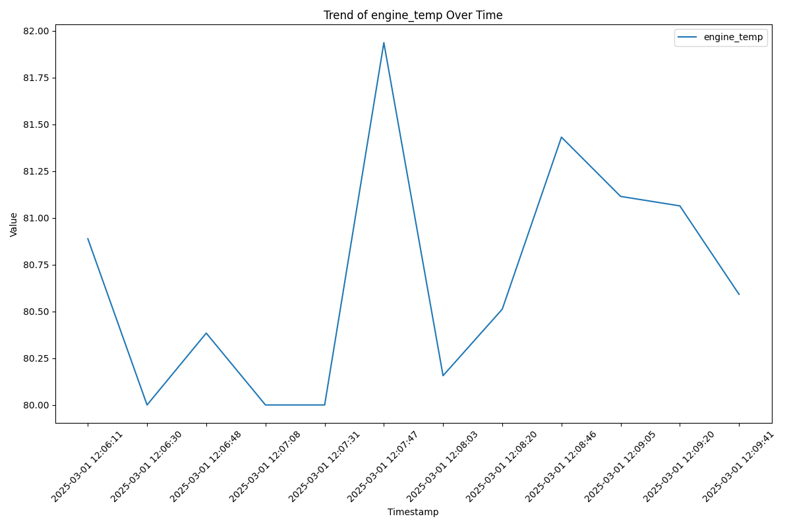
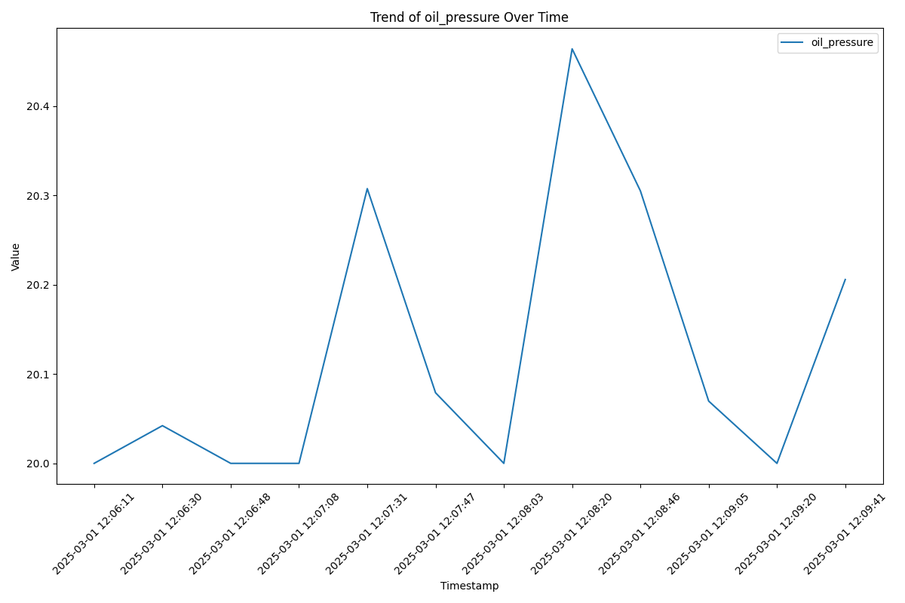
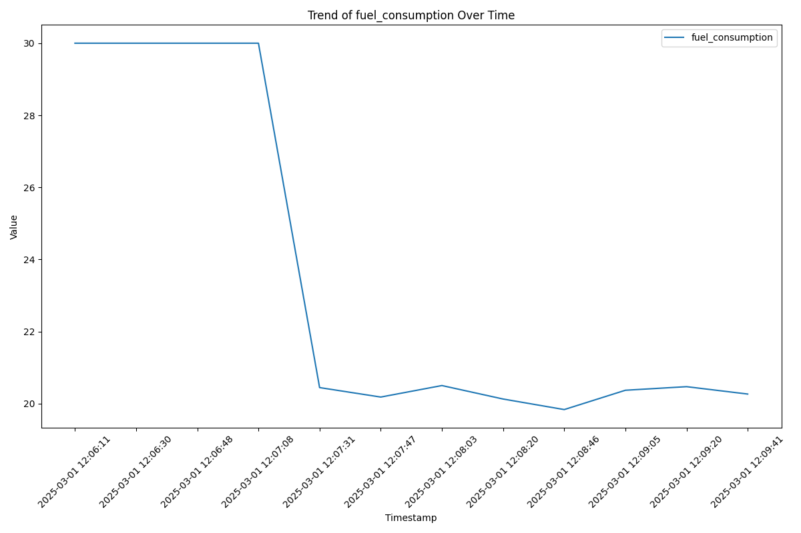
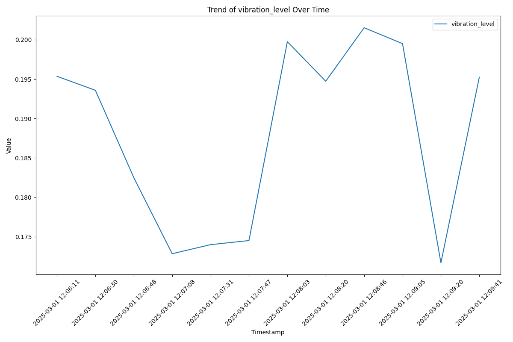
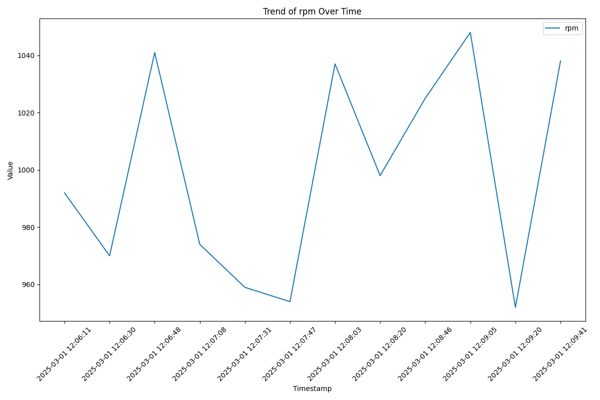
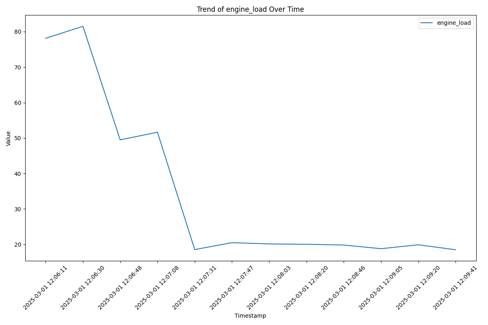

# Engine Performance Report

## Trend Analysis
- Maximum Temperature: 81.94°C
- Average Temperature: 80.67°C
- Minimum Temperature: 80.00°C
- Maximum Oil Pressure: 20.46 psi
- Average Oil Pressure: 20.12 psi
- Minimum pressure: 20.00 psi
- Fuel Consumption Trend: -1.09
- Vibration Anomalies: 0

## Component Health
- Cooling Efficiency: 79.6%
- Oil Viscosity: 0.84
- Injector Health: 73.2%

## Chronology of Events
### 2025-03-01 12:06:11 - Failure Prediction
- **Expected Class:** Mechanical Wear
- **Probabilities per Failure Module:**

|Failure Class         | Probability |
|----------------------|---------------|
| Fuel Issues          |          0.01 |
| Mechanical Wear      |          0.88 |
| No Failure           |          0.03 |
| Oil Leakage          |          0.00 |
| Overheating          |          0.09 |

- **Sensor Data:** {
  "engine_temp": 80.88799786185233,
  "running_period": 101,
  "oil_pressure": 20.0,
  "fuel_consumption": 30.0,
  "vibration_level": 0.1953599205599621,
  "rpm": 992,
  "engine_load": 78.13486173683312,
  "timestamp": "2025-03-01 12:06:11"
}

### 2025-03-01 12:06:28 - Corrective Action
- **Action:** `"monitor"`
- **Reason:** "The engine's oil pressure is below the minimum threshold and the engine load is at the maximum limit. The engine should be monitored while the following maintenance procedures are carried out: check the oil filter, verify the oil system's pressure, use UV dye testing to locate leaks, replace worn oil lines, seals, and gaskets, ensure the turbocharger oil return lines are free of blockages, and inspect the lubricating oil circulation. These actions will help increase the oil pressure and reduce the engine load, preventing potential mechanical wear."

### 2025-03-01 12:06:30 - Failure Prediction
- **Expected Class:** Mechanical Wear
- **Probabilities per Failure Module:**

|Failure Class         | Probability |
|----------------------|---------------|
| Fuel Issues          |          0.01 |
| Mechanical Wear      |          0.87 |
| No Failure           |          0.03 |
| Oil Leakage          |          0.00 |
| Overheating          |          0.09 |

- **Sensor Data:** {
  "engine_temp": 80.0,
  "running_period": 104,
  "oil_pressure": 20.042184058883812,
  "fuel_consumption": 30.0,
  "vibration_level": 0.19358499963156542,
  "rpm": 970,
  "engine_load": 81.50929889576695,
  "timestamp": "2025-03-01 12:06:30"
}

### 2025-03-01 12:06:30 - Corrective Action
- **Action:** `Action: "monitor"`
- **Reason:** Reason: "The engine's oil pressure is below the minimum threshold and the engine load is at the maximum limit. The engine should be monitored while the following maintenance procedures are carried out: check the oil filter, verify the oil system's pressure, use UV dye testing to locate leaks, replace worn oil lines, seals, and gaskets, ensure the turbocharger oil return lines are free of blockages, and inspect the lubricating oil circulation. These actions will help increase the oil pressure and reduce the engine load, preventing potential mechanical wear."

### 2025-03-01 12:06:46 - Corrective Action
- **Action:** `reduce_load`
- **Reason:** The engine load is at the maximum limit, which could be contributing to the low oil pressure. Reducing the load can help alleviate this issue.Reduced load to avoid overloading.

### 2025-03-01 12:06:48 - Failure Prediction
- **Expected Class:** Mechanical Wear
- **Probabilities per Failure Module:**

|Failure Class         | Probability |
|----------------------|---------------|
| Fuel Issues          |          0.00 |
| Mechanical Wear      |          0.97 |
| No Failure           |          0.01 |
| Oil Leakage          |          0.00 |
| Overheating          |          0.02 |

- **Sensor Data:** {
  "engine_temp": 80.38388935642077,
  "running_period": 107,
  "oil_pressure": 20.0,
  "fuel_consumption": 30.0,
  "vibration_level": 0.1825084927048143,
  "rpm": 1041,
  "engine_load": 49.48049036750872,
  "timestamp": "2025-03-01 12:06:48"
}

### 2025-03-01 12:06:48 - Corrective Action
- **Action:** `Action: reduce_load`
- **Reason:** Reason: The engine load is at the maximum limit, which could be contributing to the low oil pressure. Reducing the load can help alleviate this issue.

### 2025-03-01 12:07:06 - Corrective Action
- **Action:** `monitor`
- **Reason:** The engine is showing signs of mechanical wear and has low oil pressure. Monitoring will allow for a thorough analysis of the oil pressure levels and the condition of the crankcase ventilation system, as suggested in the Engine_1.docx document. This will help in identifying the exact issue and taking the necessary preventive measures to minimize the progression of mechanical wear.

### 2025-03-01 12:07:08 - Failure Prediction
- **Expected Class:** Mechanical Wear
- **Probabilities per Failure Module:**

|Failure Class         | Probability |
|----------------------|---------------|
| Fuel Issues          |          0.00 |
| Mechanical Wear      |          0.97 |
| No Failure           |          0.01 |
| Oil Leakage          |          0.00 |
| Overheating          |          0.02 |

- **Sensor Data:** {
  "engine_temp": 80.0,
  "running_period": 110,
  "oil_pressure": 20.0,
  "fuel_consumption": 30.0,
  "vibration_level": 0.17284671762402268,
  "rpm": 974,
  "engine_load": 51.63692558536006,
  "timestamp": "2025-03-01 12:07:08"
}

### 2025-03-01 12:07:08 - Corrective Action
- **Action:** `Action: monitor`
- **Reason:** Reason: The engine is showing signs of mechanical wear and has low oil pressure. Monitoring will allow for a thorough analysis of the oil pressure levels and the condition of the crankcase ventilation system, as suggested in the Engine_1.docx document. This will help in identifying the exact issue and taking the necessary preventive measures to minimize the progression of mechanical wear.

### 2025-03-01 12:07:29 - Corrective Action
- **Action:** `reduce_load`
- **Reason:** The engine is showing signs of mechanical wear and the oil pressure is below the minimum threshold. Reducing the engine load will help to prevent further wear and potential damage. A thorough maintenance check should also be conducted to address the mechanical wear and ensure the engine is operating within the acceptable parameters.Reduced load to avoid overloading.

### 2025-03-01 12:07:31 - Failure Prediction
- **Expected Class:** Mechanical Wear
- **Probabilities per Failure Module:**

|Failure Class         | Probability |
|----------------------|---------------|
| Fuel Issues          |          0.01 |
| Mechanical Wear      |          0.88 |
| No Failure           |          0.02 |
| Oil Leakage          |          0.07 |
| Overheating          |          0.02 |

- **Sensor Data:** {
  "engine_temp": 80.0,
  "running_period": 113,
  "oil_pressure": 20.307484455074974,
  "fuel_consumption": 20.445065282700895,
  "vibration_level": 0.17399749460156907,
  "rpm": 959,
  "engine_load": 18.52647817153243,
  "timestamp": "2025-03-01 12:07:31"
}

### 2025-03-01 12:07:31 - Corrective Action
- **Action:** `Action: reduce_load`
- **Reason:** Reason: The engine is showing signs of mechanical wear and the oil pressure is below the minimum threshold. Reducing the engine load will help to prevent further wear and potential damage. A thorough maintenance check should also be conducted to address the mechanical wear and ensure the engine is operating within the acceptable parameters.

### 2025-03-01 12:07:45 - Corrective Action
- **Action:** `"monitor"`
- **Reason:** "The engine is showing signs of mechanical wear and the oil pressure is slightly low. The preventive measures suggest monitoring the engine closely while ensuring proper lubrication and conducting regular inspections. This will help to minimize the progression of mechanical wear and maintain the oil pressure within the acceptable range."

### 2025-03-01 12:07:47 - Failure Prediction
- **Expected Class:** Mechanical Wear
- **Probabilities per Failure Module:**

|Failure Class         | Probability |
|----------------------|---------------|
| Fuel Issues          |          0.01 |
| Mechanical Wear      |          0.89 |
| No Failure           |          0.02 |
| Oil Leakage          |          0.07 |
| Overheating          |          0.02 |

- **Sensor Data:** {
  "engine_temp": 81.93566898996181,
  "running_period": 116,
  "oil_pressure": 20.0790074454386,
  "fuel_consumption": 20.182382442409796,
  "vibration_level": 0.17451611322791852,
  "rpm": 954,
  "engine_load": 20.482156458394627,
  "timestamp": "2025-03-01 12:07:47"
}

### 2025-03-01 12:07:47 - Corrective Action
- **Action:** `Action: "monitor"`
- **Reason:** Reason: "The engine is showing signs of mechanical wear and the oil pressure is slightly low. The preventive measures suggest monitoring the engine closely while ensuring proper lubrication and conducting regular inspections. This will help to minimize the progression of mechanical wear and maintain the oil pressure within the acceptable range."

### 2025-03-01 12:08:01 - Corrective Action
- **Action:** `"monitor"`
- **Reason:** "The engine is showing signs of mechanical wear and the oil pressure is slightly low. It is recommended to monitor the engine closely, conduct vibration analysis, oil analysis for wear particles, check for excessive clearances in bearings and cylinder liners, and conduct ultrasonic thickness measurements on critical components. The crankcase ventilation systems should be inspected, oil pressure levels should be analyzed, and proper filtration should be ensured."

### 2025-03-01 12:08:03 - Failure Prediction
- **Expected Class:** Mechanical Wear
- **Probabilities per Failure Module:**

|Failure Class         | Probability |
|----------------------|---------------|
| Fuel Issues          |          0.01 |
| Mechanical Wear      |          0.89 |
| No Failure           |          0.02 |
| Oil Leakage          |          0.07 |
| Overheating          |          0.02 |

- **Sensor Data:** {
  "engine_temp": 80.15640508821969,
  "running_period": 119,
  "oil_pressure": 20.0,
  "fuel_consumption": 20.501603717347827,
  "vibration_level": 0.19975498871852104,
  "rpm": 1037,
  "engine_load": 20.127258009876837,
  "timestamp": "2025-03-01 12:08:03"
}

### 2025-03-01 12:08:03 - Corrective Action
- **Action:** `Action: "monitor"`
- **Reason:** Reason: "The engine is showing signs of mechanical wear and the oil pressure is slightly low. It is recommended to monitor the engine closely, conduct vibration analysis, oil analysis for wear particles, check for excessive clearances in bearings and cylinder liners, and conduct ultrasonic thickness measurements on critical components. The crankcase ventilation systems should be inspected, oil pressure levels should be analyzed, and proper filtration should be ensured."

### 2025-03-01 12:08:18 - Corrective Action
- **Action:** `"monitor"`
- **Reason:** "The engine is showing signs of mechanical wear. The oil pressure is slightly below the minimum threshold, and the cooling efficiency, oil viscosity, and injector health are not optimal. However, the engine is not in immediate danger of failure. Continue to monitor the engine and plan for maintenance to address the mechanical wear."

### 2025-03-01 12:08:20 - Failure Prediction
- **Expected Class:** Mechanical Wear
- **Probabilities per Failure Module:**

|Failure Class         | Probability |
|----------------------|---------------|
| Fuel Issues          |          0.01 |
| Mechanical Wear      |          0.89 |
| No Failure           |          0.01 |
| Oil Leakage          |          0.07 |
| Overheating          |          0.02 |

- **Sensor Data:** {
  "engine_temp": 80.51165533463242,
  "running_period": 122,
  "oil_pressure": 20.463924820122344,
  "fuel_consumption": 20.127997532166766,
  "vibration_level": 0.19473142490098572,
  "rpm": 998,
  "engine_load": 20.022356551624146,
  "timestamp": "2025-03-01 12:08:20"
}

### 2025-03-01 12:08:20 - Corrective Action
- **Action:** `Action: "monitor"`
- **Reason:** Reason: "The engine is showing signs of mechanical wear. The oil pressure is slightly below the minimum threshold, and the cooling efficiency, oil viscosity, and injector health are not optimal. However, the engine is not in immediate danger of failure. Continue to monitor the engine and plan for maintenance to address the mechanical wear."

### 2025-03-01 12:08:44 - Corrective Action
- **Action:** `monitor`
- **Reason:** The engine is showing signs of mechanical wear. To reduce downtime and enhance engine longevity, it is necessary to conduct vibration analysis, oil analysis, and check for excessive clearances in bearings and cylinder liners. An oil filtration system should be implemented to improve oil pressure. IoT sensors should be used to monitor the engine status in real time. A thermography inspection should be conducted to detect any hotspots in bearings.

### 2025-03-01 12:08:46 - Failure Prediction
- **Expected Class:** Mechanical Wear
- **Probabilities per Failure Module:**

|Failure Class         | Probability |
|----------------------|---------------|
| Fuel Issues          |          0.01 |
| Mechanical Wear      |          0.87 |
| No Failure           |          0.03 |
| Oil Leakage          |          0.08 |
| Overheating          |          0.02 |

- **Sensor Data:** {
  "engine_temp": 81.43098208330517,
  "running_period": 125,
  "oil_pressure": 20.304951328394598,
  "fuel_consumption": 19.835135137156545,
  "vibration_level": 0.2015236589777539,
  "rpm": 1025,
  "engine_load": 19.811267675368295,
  "timestamp": "2025-03-01 12:08:46"
}

### 2025-03-01 12:08:46 - Corrective Action
- **Action:** `Action: monitor`
- **Reason:** Reason: The engine is showing signs of mechanical wear. To reduce downtime and enhance engine longevity, it is necessary to conduct vibration analysis, oil analysis, and check for excessive clearances in bearings and cylinder liners. An oil filtration system should be implemented to improve oil pressure. IoT sensors should be used to monitor the engine status in real time. A thermography inspection should be conducted to detect any hotspots in bearings.

### 2025-03-01 12:09:03 - Corrective Action
- **Action:** `monitor`
- **Reason:** The oil pressure is slightly below the minimum threshold, but it's not fluctuating or excessively high. The engine load is well below the maximum limit, and the temperature is within the acceptable range. Monitoring the engine will allow us to keep an eye on these parameters and take action if necessary.

### 2025-03-01 12:09:05 - Failure Prediction
- **Expected Class:** Mechanical Wear
- **Probabilities per Failure Module:**

|Failure Class         | Probability |
|----------------------|---------------|
| Fuel Issues          |          0.01 |
| Mechanical Wear      |          0.87 |
| No Failure           |          0.03 |
| Oil Leakage          |          0.07 |
| Overheating          |          0.02 |

- **Sensor Data:** {
  "engine_temp": 81.11431128585323,
  "running_period": 128,
  "oil_pressure": 20.069679734166073,
  "fuel_consumption": 20.37110641742237,
  "vibration_level": 0.19950337711640106,
  "rpm": 1048,
  "engine_load": 18.777986095850288,
  "timestamp": "2025-03-01 12:09:05"
}

### 2025-03-01 12:09:05 - Corrective Action
- **Action:** `Action: monitor`
- **Reason:** Reason: The oil pressure is slightly below the minimum threshold, but it's not fluctuating or excessively high. The engine load is well below the maximum limit, and the temperature is within the acceptable range. Monitoring the engine will allow us to keep an eye on these parameters and take action if necessary.

### 2025-03-01 12:09:18 - Corrective Action
- **Action:** `reduce_load`
- **Reason:** The engine is showing signs of mechanical wear and the oil pressure is slightly below the minimum threshold. Reducing the engine load will help to alleviate the stress on the engine components and prevent further wear. A maintenance check should also be scheduled to address the mechanical wear and low oil pressure.Reduced load to avoid overloading.

### 2025-03-01 12:09:20 - Failure Prediction
- **Expected Class:** Mechanical Wear
- **Probabilities per Failure Module:**

|Failure Class         | Probability |
|----------------------|---------------|
| Fuel Issues          |          0.01 |
| Mechanical Wear      |          0.86 |
| No Failure           |          0.03 |
| Oil Leakage          |          0.08 |
| Overheating          |          0.03 |

- **Sensor Data:** {
  "engine_temp": 81.06378415086913,
  "running_period": 131,
  "oil_pressure": 20.0,
  "fuel_consumption": 20.470533082903103,
  "vibration_level": 0.17169381073881818,
  "rpm": 952,
  "engine_load": 19.88210006729097,
  "timestamp": "2025-03-01 12:09:20"
}

### 2025-03-01 12:09:20 - Corrective Action
- **Action:** `Action: reduce_load`
- **Reason:** Reason: The engine is showing signs of mechanical wear and the oil pressure is slightly below the minimum threshold. Reducing the engine load will help to alleviate the stress on the engine components and prevent further wear. A maintenance check should also be scheduled to address the mechanical wear and low oil pressure.

### 2025-03-01 12:09:39 - Corrective Action
- **Action:** `reduce_load`
- **Reason:** The engine is showing signs of mechanical wear and the oil pressure is below the minimum threshold. Reducing the load on the engine could potentially help increase the oil pressure.Reduced load to avoid overloading.

### 2025-03-01 12:09:41 - Failure Prediction
- **Expected Class:** Mechanical Wear
- **Probabilities per Failure Module:**

|Failure Class         | Probability |
|----------------------|---------------|
| Fuel Issues          |          0.01 |
| Mechanical Wear      |          0.88 |
| No Failure           |          0.02 |
| Oil Leakage          |          0.07 |
| Overheating          |          0.03 |

- **Sensor Data:** {
  "engine_temp": 80.59111539568441,
  "running_period": 134,
  "oil_pressure": 20.20572171895346,
  "fuel_consumption": 20.265702735237262,
  "vibration_level": 0.19524163874809458,
  "rpm": 1038,
  "engine_load": 18.48392288221077,
  "timestamp": "2025-03-01 12:09:41"
}

### 2025-03-01 12:09:41 - Corrective Action
- **Action:** `Action: reduce_load`
- **Reason:** Reason: The engine is showing signs of mechanical wear and the oil pressure is below the minimum threshold. Reducing the load on the engine could potentially help increase the oil pressure.

### 2025-03-01 12:09:59 - Corrective Action
- **Action:** `reduce_load`
- **Reason:** The engine is showing signs of mechanical wear and the oil pressure is below the minimum threshold. Reducing the load will help to prevent further wear and tear on the engine's components. A maintenance check should be scheduled to inspect the engine's components and perform necessary repairs or replacements.Reduced load to avoid overloading.

### 2025-03-01 12:10:01 - Corrective Action
- **Action:** `Action: reduce_load`
- **Reason:** Reason: The engine is showing signs of mechanical wear and the oil pressure is below the minimum threshold. Reducing the load will help to prevent further wear and tear on the engine's components. A maintenance check should be scheduled to inspect the engine's components and perform necessary repairs or replacements.

### 2025-03-01 12:10:47 - Corrective Action
- **Action:** `monitor`
- **Reason:** The engine is showing signs of mechanical wear and the oil pressure is below the minimum threshold. It is recommended to monitor the engine closely, conduct a thorough diagnosis and analysis as suggested in the document, and implement the preventive measures and maintenance procedures to minimize the progression of mechanical wear and enhance engine longevity.

## Performance Analysis by the Expert
Executive Summary:
The engine has been operating for 136 hours and is showing signs of mechanical wear. The cooling efficiency is at 79.6%, oil viscosity is at 0.84, and injector health is at 73.2%. There have been 24 interventions in the stock history. The engine is currently in a reduce_load status, indicating that it is under stress.

Main Risks Identified:
1. Mechanical Wear: The engine is showing signs of mechanical wear, which could lead to breakdowns if not addressed.
2. Reduced Cooling Efficiency: The cooling efficiency is below optimal levels, which could lead to overheating.
3. Oil Viscosity: The oil viscosity is slightly high, which could affect the engine's performance.
4. Injector Health: The injector health is below optimal levels, which could affect fuel efficiency and engine performance.

Recommended Action Plan:
1. Conduct a pressure test to check for leaks.
2. Use accelerometers to detect any resonance in lines that could cause mechanical fatigue.
3. Check the preheaters and viscosity regulators to ensure they are maintaining the correct temperature and viscosity.
4. Adjust the injection timing as necessary.
5. Implement preventive measures such as fuel polishing, adding chemical additives, and real-time monitoring.
6. Consider using alternative fuels if the engine is dual-fuel.

Prioritized List of Issues and Corrective Actions:
1. Mechanical Wear: Conduct vibration inspection and oil analysis to assess the extent of the wear. Implement preventive measures such as real-time monitoring and fuel polishing.
2. Cooling Efficiency: Check the cooling system for any issues and make necessary repairs.
3. Oil Viscosity: Ensure the preheaters and viscosity regulators are working properly to maintain the correct oil temperature and viscosity.
4. Injector Health: Adjust the injection timing and consider using chemical additives to improve injector health.

Efficiency Insights and Operational Optimization Suggestions:
1. Fuel Consumption: Monitor the injection pressure to optimize fuel consumption.
2. Thermal Efficiency: Regularly clean the heat exchangers to maintain thermal efficiency.
3. Operational Adjustments: Reduce load on the engine to minimize wear.
4. Component Lifespan: Implement preventive measures such as real-time monitoring and fuel polishing to extend the lifespan of engine components.

## Trend Charts
### Engine Temp

### Oil Pressure

### Fuel Consumption

### Vibration Level

### Rpm

### Engine Load

